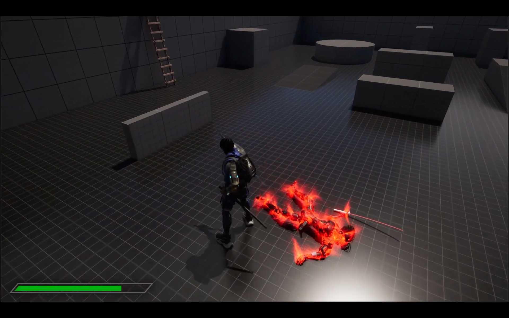

# Project Samurai
Developing another passionate personal project on Unreal Engine using blueprints and also implementing combat mechanics of a samurai.

## Motivation
Developing combat mechanics similar to the Sucker Punch Production's Ghost of Tsushima also enhancing the quality by implementing various UI elements and environments in Unreal Engine 
See the project in action here => https://www.youtube.com/playlist?list=PLCXXIoh9PICX-335XxuY3LUYpFKnUFcoF

## Screenshots

## License
[MIT](https://choosealicense.com/licenses/mit/)
