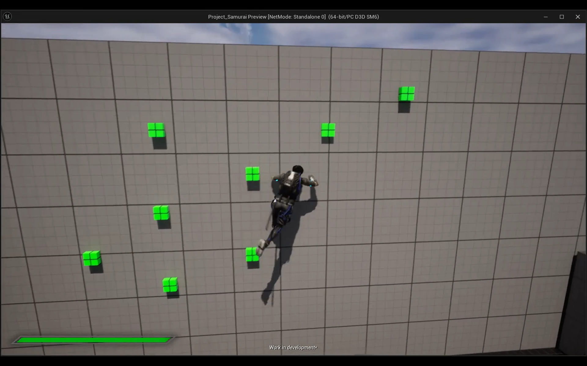

# Project Samurai
An alpha stage project that has mechanics like combat, stealth, destruction, and parkour using components like motion warping, chaos, and blueprint classes like blend spaces, widgets, interfaces, etc. Also designing a prototype level for debugging in Unreal Engine.

## Motivation
Developing combat mechanics similar to the Sucker Punch Production's Ghost of Tsushima also enhancing the quality by implementing various UI elements and environments in Unreal Engine 
See the project in action here => https://www.youtube.com/playlist?list=PLCXXIoh9PICX-335XxuY3LUYpFKnUFcoF

## Screenshots

## License
[MIT](https://choosealicense.com/licenses/mit/)
